# LearningAssemblyLanguage
> 2020年5月7日更新
> 这次主要更新了配套的汇编语言书籍，这个版本非网上下载的扫描版本，而是某泉学堂直接原始文稿生成的版本，全网清晰度质量最高，如果喜欢纸质版请支持正版自行购买。
> 配套课件：
> 链接:https://pan.baidu.com/s/13SHb30Ou3hIaeC3K-Dya6A 提取码:vqqv 
> 复制这段内容后打开百度网盘手机App，操作更方便哦
> 配套书籍：
> 链接: https://pan.baidu.com/s/178P7pxsQu4c67mEYnWa3QQ 提取码: 2ncu 
> 复制这段内容后打开百度网盘手机App，操作更方便哦

## 1 教程简介

### 1.1视频使用指南

### 1.2 视频通知2019年7月25日

## 2 汇编语言环境准备及相关软件

### 2.1DosBox下载和安装

#### 配置DosBox.exe和Debug.exe

##### 工具包所在位置：

>LearningAssemblyLanguage\课程工具包\章节2\DosBox的下载安装与使用 MAC(差不多) WIN 7 WIN10 用户必看！

##### 安装DosBox.exe,分别点击next,next,install,close即可

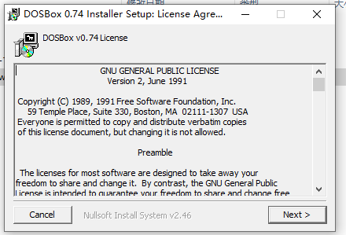

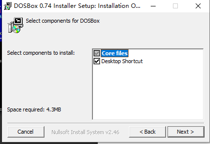

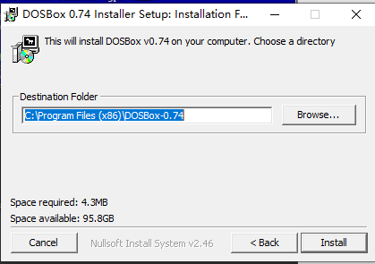

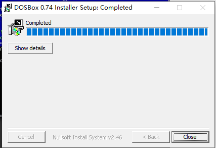


##### 新建Asm文件夹

##### 复制debug.exe到文件夹Asm下，debug.exe的具体路径为

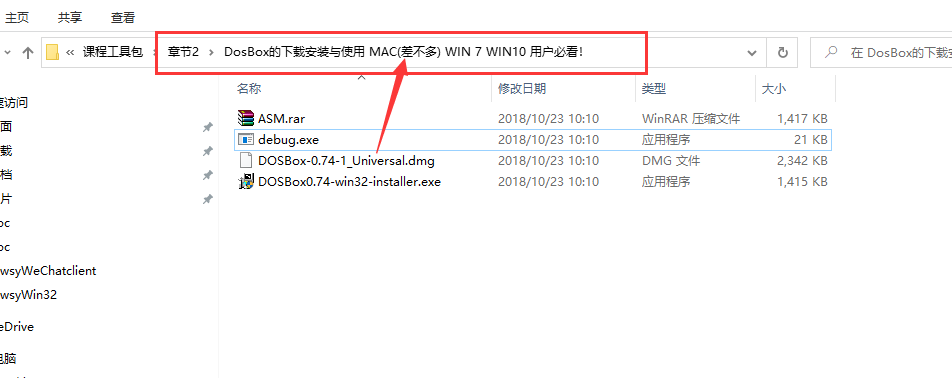

##### 双击打开软件

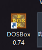

##### 打开后的软件页面的形式

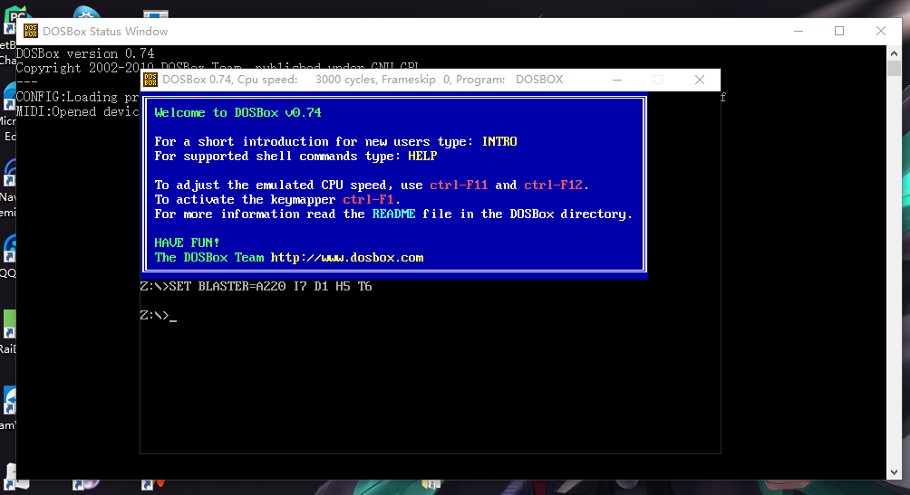

##### 打开DosBox0.74执行命令mount  c:  E:\CodeLibraries\LearningAssemblyLanguage\Asm(此处应该填写具体的路径，第二个参数)，再执行c:,再执行debug命令.

###### 相关代码

```
mount  c:  E:\CodeLibraries\LearningAssemblyLanguage\Asm
c:
debug
```

###### 执行的详细过程

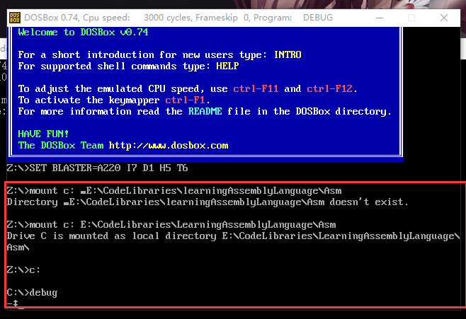

###### 可以输入d命令，可以看到如下输出

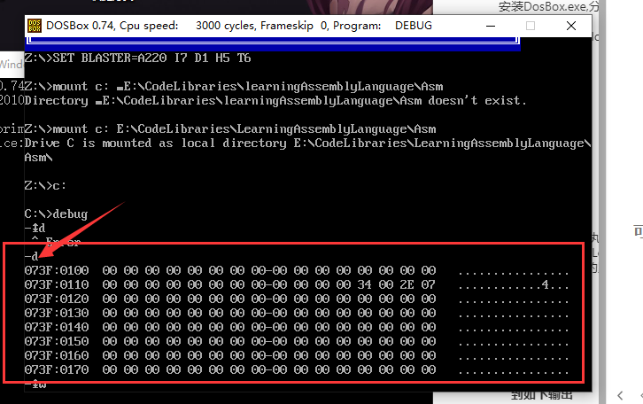

#### 通过配置文件避免复杂重复的劳动

##### 在上面配置DosBox.exe和Debug.exe的时候，我们执行了三个命令 mount、c:、debug，其实我们可以通过配置文件来简化上述操作不然每次都需要这样来操作，才能进入相应的环境

###### 配置的方法如下

1、通过DosBox Status Window找到conf所在路径

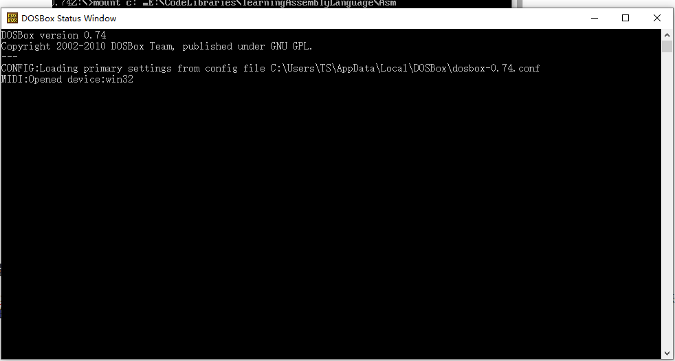

2、找到dosbox-0.74.conf之后，底部添加如下内容即可

```
mount  c:  E:\CodeLibraries\LearningAssemblyLanguage\Asm
c:
```

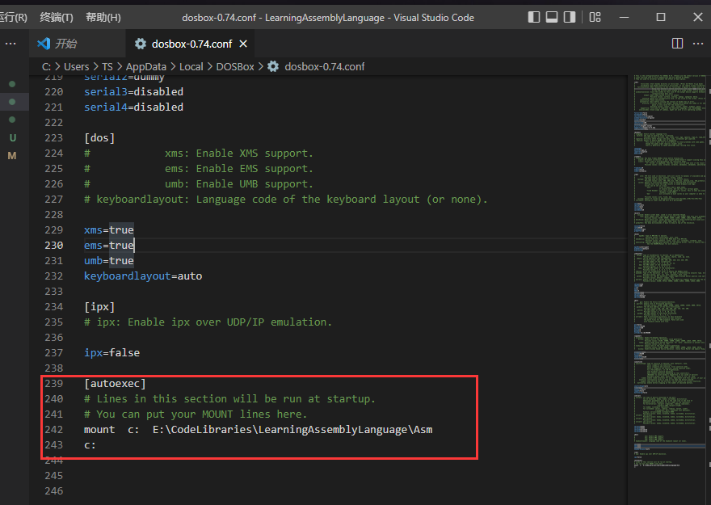

3、双击打开文件


4、执行debug命令

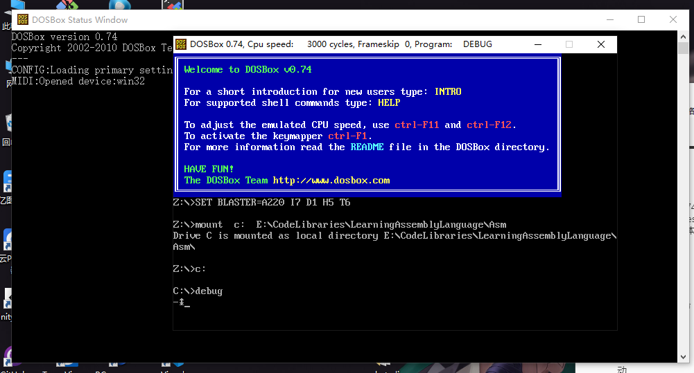

### 2.2 Vim文本编辑器下载安装和配置

### 2.3 Win10 Vim说明

### 2.4 源代码的编译和链接，将源码生成最终的exe然后执行

#### 在视频的参考资料中，都有如下文件，拷贝到文件夹Asm下

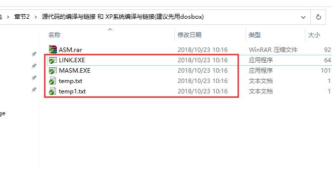

#### 在Asm文件夹下新建t1.asm文件，将temp.txt中的内容复制过去

#### 执行命令 masm t1 ;link t1

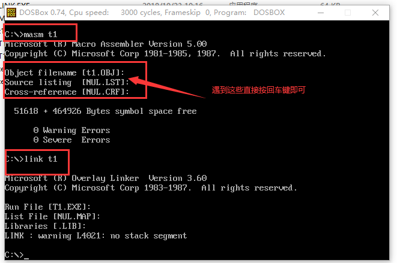

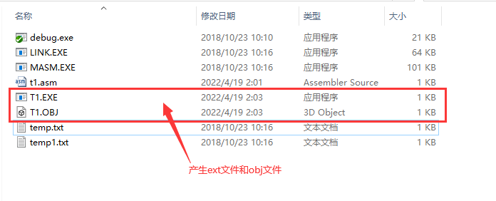

#### 执行程序T1.EXE

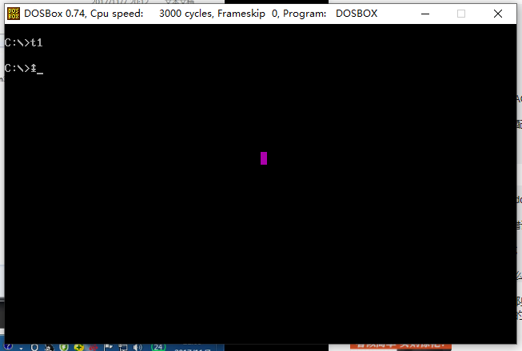

## 3 编码思想，形成自己的编程思想，行为方式

### 3.1 编码---人类观测世界的方式

#### 术语

###### 希腊人是如何表示大地上的位置的？

经度和纬度的编码系统对大地位置进行表示

###### 编码系统：表示系统

编码是人类对世界的表示

##### 长度：米、厘米、英寸、英尺

##### 一天=24小时  1小时=60分钟 1分钟=60秒

##### 汉字：中文语言，语言交流

汉字是如何对世界表示的？

汉字是一种图形，是用图形对世界的表示

中文语言、

我们是如何表示我们说话的声波的？

a o e....拼音字母，对我们发出的声波 声波的一种表示

……………………

### 3.2 编码是对人类世界表示 解决英语单词如何背

### 3.3 背点单词

### 3.4 我学习英语的方式

###  3.5 用编码的思想解决一个数学问题

### 3.6 世界与计算与计算要素

### 3.7 计算要素与表示系统

### 3.8 承上启下世界与观测

### 3.9 计算机编程语言是一套______系统？

数学是一种语言,汉语是一种语言,英语也是一种语言,语言是互相交流的表示系统.计算机编程语言是一套表示系统，人类和计算机相互交流的。

#### 计算机语言分类

##### 低级语言

汇编语言

##### 高级语言

C++

python

Java

#### 汇编语言的作用

观测手段，从机器角度思考问题，思维方式

#### 形成自己的编程思想

通过观测和不断做实验方式，吸收知识，形成自己的思维方式，形成自己的编程思想。我们只不过是将我们思维方式，用计算机编程语言表示出来而已

## 4 计算机中的进制

### 4.1 十进制

>437  = 400+30+7
>
>​        = 4\*100+3\*10
>
>​		= 4\*10^2+3\*10^1+7\*10^0


>10^0 	10^1	10^2	10^3 ……
>
>1			10		100	   1000 ……
>
>从左到右依次*10，从右到左边依次除以10

### 4.2 二进制

> 2^0(0)	2^1(2)	2^3(8)	2^4(16)	2^5(32) 

>二进制数: 1011 = 1\*8+0\*4+1\*2+1\*1 = 15 
>
>二进制数: 11001=1\*16+1\*8+0\*4+0\*2+1\*1 = 25

### 4.3 十进制转化为二进制

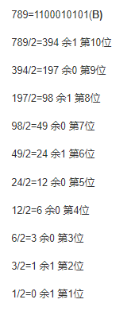

>**原理：**
>
>众所周知，二进制的基数为2，我们十进制化二进制时所除的2就是它的基数。谈到它的原理，就不得不说说关于位权的概念。某进制计数制中各位数字符号所表示的数值表示该数字符号值乘以一个与数字符号有关的常数，该常数称为 “位权 ” 。位权的大小是以基数为底，数字符号所处的位置的序号为指数的整数次幂。十进制数的百位、十位、个位、十分位的权分别是10的2次方、10的1次方、10的0次方，10的-1次方。二进制数就是2的n次幂。
>
>按权展开求和正是非十进制化十进制的方法。
>
>下面我们开讲原理，举个十进制整数转换为二进制整数的例子，假设十进制整数A化得的二进制数为edcba 的形式，那么用上面的方法按权展开， 得
>
>A=a(2^0)+b(2^1)+c(2^2)+d(2^3)+e(2^4) （后面的和不正是化十进制的过程吗）
>
>假设该数未转化为二进制,除以基数2得
>
>A/2=a(2^0)/2+b(2^1)/2+c(2^2)/2+d(2^3)/2+e(2^4)/2
>
>注意：a不能整除2，但其他的能整除，因为他们都包含2，而a乘的是1，他本身绝对不包含因数2，只能余下。
>
>商得：
>
>b(2^0)+c(2^1)+d(2^2)+e(2^3)，再除以基数2余下了b，以此类推。
>
>当这个数不能再被2除时，先余掉的a位数在原数低，而后来的余数数位高，所以要把所有的余数反过来写。正好是edcba

### 4.4 十进制快速转化为二进制

通过观察数轴来快速确定二进制

>64	32	16	8	4	2	1     // 二进制数轴
>
>1		0	 0	  0    1     1   0    =  70  
>
>70=1000110

### 4.5 十六进制

十进制：满10进1

二进制：满2进1

十六进制的数：0123456789ABCDEF

>A=10
>
>B=11
>
>C=12
>
>D=13
>
>E=14
>
>F=15

57(十进制数) = 3*16+9 = 39(十六进制)  

### 4.6 十进制转化成十六进制

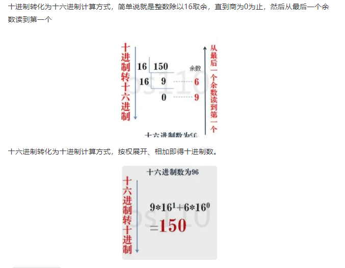

### 4.7 十进制快速转化为十六进制

### 4.8 十六进制与二进制快速转化

>10(十六进制) = 0001 0000
>
>9(十六进制) = 1001
>
>25(十六进制) = 0010 0101

### 4.9 反过来思考

通过观察快速转换进制数

## 5 基础知识

### 5.1 二进制和汇编语言的关系

计算机是由什么驱动的呢？

电。计算机是一台机器，由很多部件组成，依靠指令(告诉他这里该咋做，哪里该咋做)组织运行。

> 机器指令 010101010101

cpu的部件	中央处理器

将一串二进制数字转化为高低电平，驱动计算机执行。

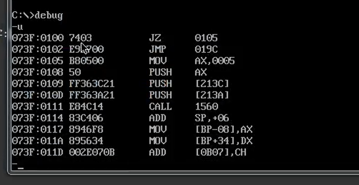

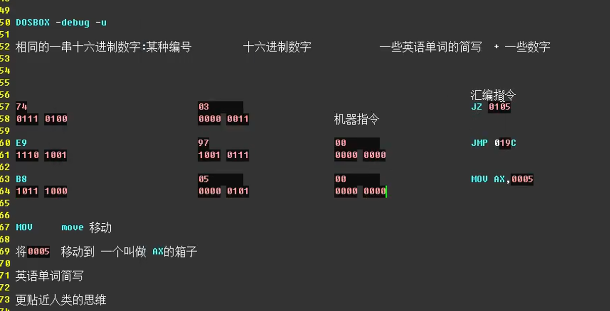


>汇编语言
>
>1、汇编指令 通过编译器也就是翻译软件 翻译成机器指令 机器码
>
>2、伪指令     告诉编译器也就是翻译软件你这里该怎么翻译哪里该咋翻译
>
>3、符号体系 +-*/ 编译器管


>1 什么是机器指令？
>
>```
>0101010101
>```
>
>2 机器指令由谁执行？
>
>```
>cpu
>```
>
>3 机器指令和和汇编指令有什么关系？
>
>```
>通过编译器也就是翻译软件，可以将汇编指令转化为机器指令
>```
>
>4 什么是编译器？
>
>```
>翻译软件，主要功能为将汇编指令转化为具体的机器指令
>```
>
>5 什么是伪指令？
>
>```
>告诉编译器，也就是翻译软件，这里该怎么翻译，哪里该怎么翻译
>```
>

### 5.2 汇编指令存放在什么地方

内存编号 为什么是 073F:02CE 这样的形式？

内存编号 为什么是从0开始的？

cpu如何区分指令和数据？

汇编指令存放在哪里？ cpu存放

100万条汇编指令 存放在哪里？

内存 内存条 主内存 绝大多数 指令和数据都是存放在内存条中的


#### u指令和d指令解释不同

u指令我们看到是机器指令和汇编指令

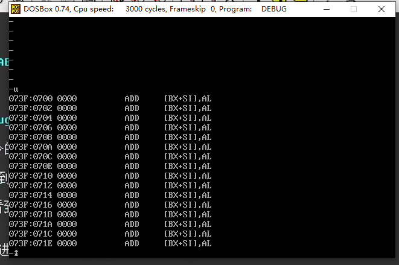

d指令 我们看到的是数据

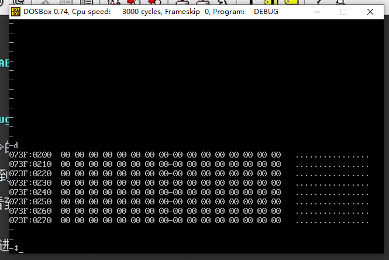

同一串 十六进制数字产生了2中解释，指令 数据

#### 内存最小单元

>一个字节 = 2个十六进制位 = 8个2进制位
>
>1byte = 8bit
>
>1kb = 1024bit
>
>1Mb = 1024kb
>
>1gb = 1024mb 

### 5.3 内存编号为啥是从0开始的？

cpu中存放了一部分指令数据，内存中存放剩下一部分指令数据。指令和数据在内存中是没有任何区别的。

cpu要从内存条中读取指令和数据怎么做？由于cpu中空间比较狭小，从内存中读取数据后，还需要将剩下数据重新放回到内存中


cpu 和内存条都是插在一块电路板，cpu和内存条之间进行联系需要通过这些电路

表示三种关系

>内存编号信息          地址线   内存地址   电路其实就是一种导线
>
>数据信息                  数据线
>
>读写信息                  控制线

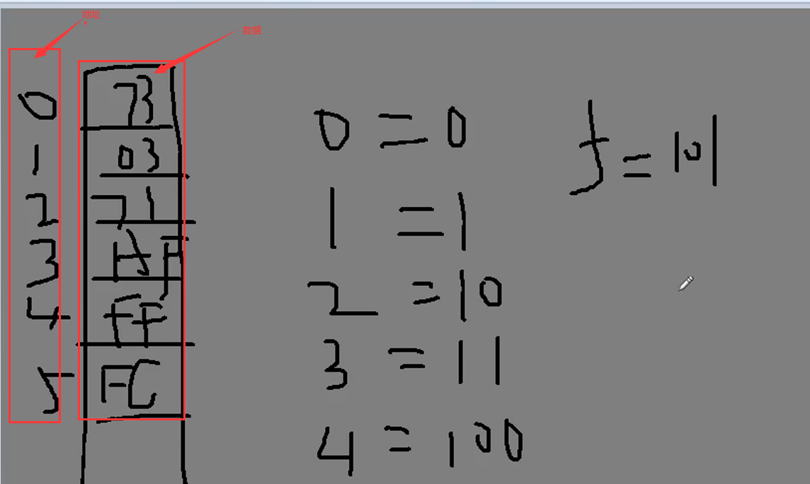

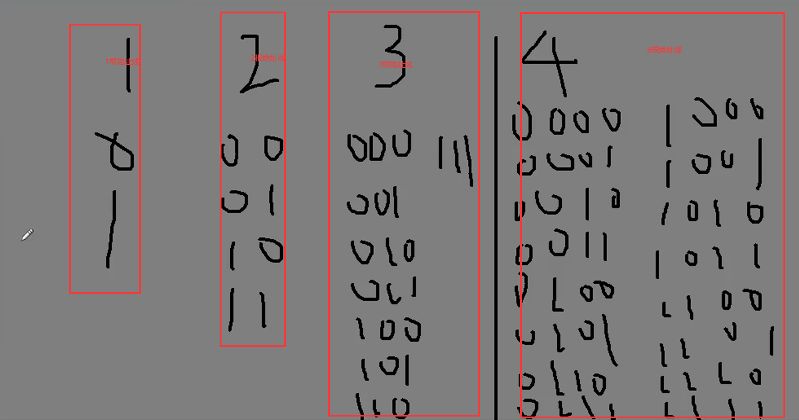

地址线决定了寻址能力，有几根地址线就可以有2^(地址线数量)的地址范围

### 5.4 数据线、控制线

地址线 决定了cpu寻址能力

数据线 决定了cpu和其他部件进行数据传送时，一次性能够传送多少数据的能力

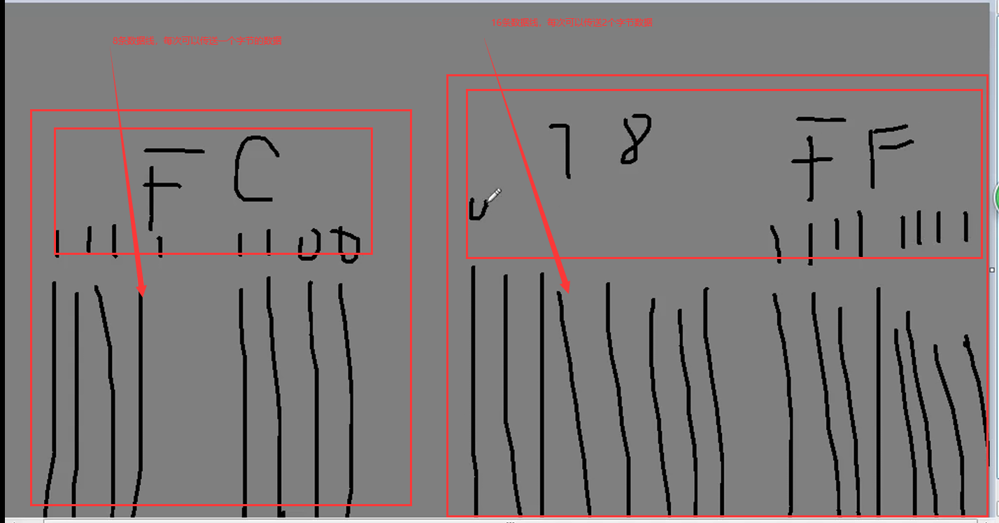

控制线 决定了cpu对其他部件的控制能力

### 5.5 检测点1.1前置数学知识

>1byte = 8bit
>
>1kb = 1024byte
>
>1mb = 1024 kb
>
>1gb = 1024mb
>
>1mb = 1024kb = 1024*1024 = 1048576 byte
>
>1mb = 2^(10)kb = 2^(10)*2^(10) = 2^(20)byte
>
>1gb = 2^(20)*2^(10)=2^(30)

>总结：
>
>1kb = 2^10 byte
>
>1mb = 2^20 byte
>
>1gb = 2^30 byte

### 5.6 检测点1.1

* 1 1个cpu的寻址能力为8kb，那么它的地址总线宽度为\_\_\_\_

  >8kb = 8\*2^10 = 2^3\*2^10 = 2^13
  >
  >所以地址总线宽度为13根
  
* 2  1kb存储器有\_\_\_存储单元，编号从\_\_\_到编号\_\_\_

  >1kb = 2^10byte = 1024byte
  >
  >编号采用16进制表示吧
  >
  >0100 0000 0000 b = 400 H
  >
  >编号范围 000 ~ 400 (十六进制表示)或者0~1023(十进制表示)

* 3   1kb存储器可以存储\_\_\_bit,\_\_\__byte

  >1kb = 2^10byte = 1024byte = 8192bit
  
* 4   1gb,1mb,1kb 分别是\_\_\_byte,\_\_\_byte,\_\_\_byte

  >2^30
  >
  >2^20
  >
  >2^10

* 5 8080,8088,80286,80386地址总线宽度分别为16根，20根，24根，32根，则他们的寻址能力分别为\_\_\_mb,\_\_\_mb,\_\_\_mb,\_\_\_gb

  >2^16(byte) = 2^10\*2^6(byte) = 2^6(kb) = 64kb
  >
  >2^20 (byte)= 1mb
  >
  >2^24 (byte)= 2^4\*2^20 = 16mb
  >
  >2^32(byte) = 2^2\*2^30 = 4gb 

* 6 8080,8088,8086,80286,80386 数据总线宽度分别为8根，8根，16根，16根，32根，则他们依次的传输数据能力分别为\_\_\_b,\_\_\_b,\_\_\_b,\_\_\_b，\_\_\_b

>1
>
>1
>
>2
>
>2
>
>4

* 7 从内存中读取1024个字节数据，8086至少需要读取\_\_\_次，80386至少读取\_\_\_次

  >1024/2 = 512
  >
  >1024/4 = 256

* 8 存储器中，数据和指令以\_\_\_形式存放

  >二进制方式    
  >
  >debug  显示为16进制只是为了方便

### 5.7 加深对内存的认识

内存 内存条 主内存

通过e指令修改内存中的内容，然后大家注意观察

>操作步骤，依次输入如下指令：
>
>debug
>
>e B800:400
>
>回车
>
>1空格
>
>1空格
>
>2空格
>
>2空格
>
>……


>e 2000:0
>
>1 空格
>
>1 空格
>
>……

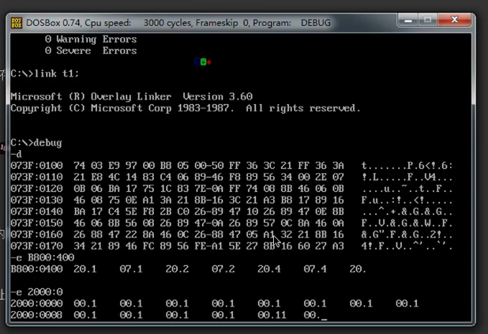

内存地址是不是内存条的内存地址？

明显不是

计算器有很多部件，内存条是计算机的一个部件，显卡，显存 插在主板上，显示器和主板

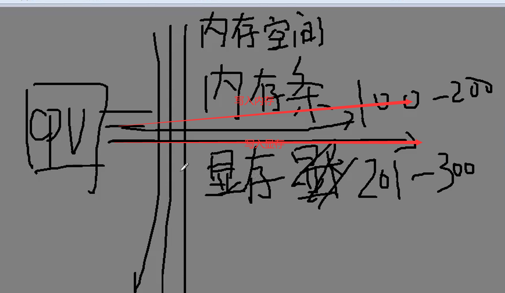

1、cpu和计算机各个部件之间的关系？

内存条 显卡 给他们编号

2、什么是ram内存？

允许读取和写入 断电后，指令和数据就丢失了。

3、什么是rom内存？

只允许读取 断电后，指令还存在， 一般用在启动计算机上

### 5.8 什么是端口

cpu 也是通过地址内存去访问鼠标键盘吗？ 不是的

端口 port 相当于港口(装货和卸货)，数据

鼠标和键盘里边也有一块芯片（存储指令和数据），cpu也是块芯片（存储指令和数据）

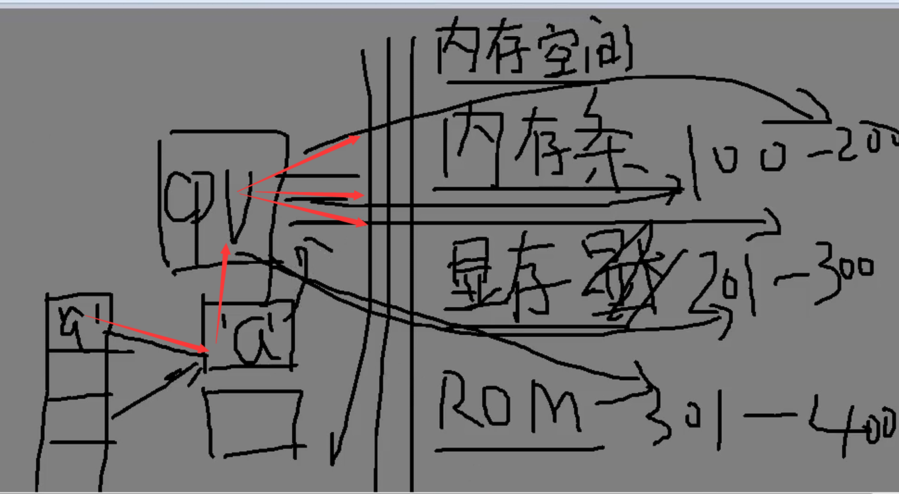

> input  output 和端口相关，读取和写入  ，控制线读写信息
>
> mov 和内存相关


> cpu可以通过主板上的电路读取到所有数据
>
> cpu 就像人的大脑一样
>
> 主板 就像人的骨骼
>
> 主板上的电路就像附加在骨骼上的神经
>
> 大脑得到反应 就像cpu得到数据一样
>
> 计算机又称为电脑，非常形象

### 5.9 承上启下

ram：断电后数据就没了 允许写入和读取

rom：断电后指令和数据还存在 只允许读取


cpu：以前是没有图形处理芯片的(gpu)，早期的时候画图这个功能也是cpu做的.后面由于图像越来越复杂，需要进行分工，所以gpu就是用来处理图像的。


gpu也是有专门的语言去编程的。但是能我劝大家别去碰他。帮助很小。


现在只需要吧B800:400当做显存就可以了。


汇编语言针对啥的？

针对cpu的地址线，数据线，控制线。

cpu中存放地址信息和数据信息的地方就叫做寄存器

我们汇编程序员就是通过汇编语言中的汇编指令去修改寄存器中的内容，从而控制cpu，就可以控制整个计算机。

mov ax,0005 ax就是一个数据寄存器


学到后边，寄存器都不够用

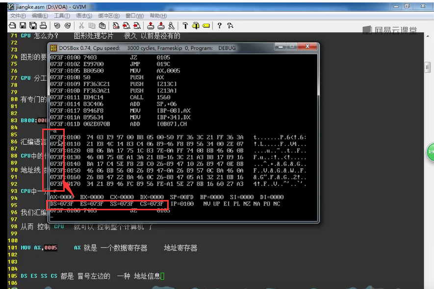

ds es ss cs都是冒号左边的，是一种地址信息，和ip比较像

### 5.10 正式导言

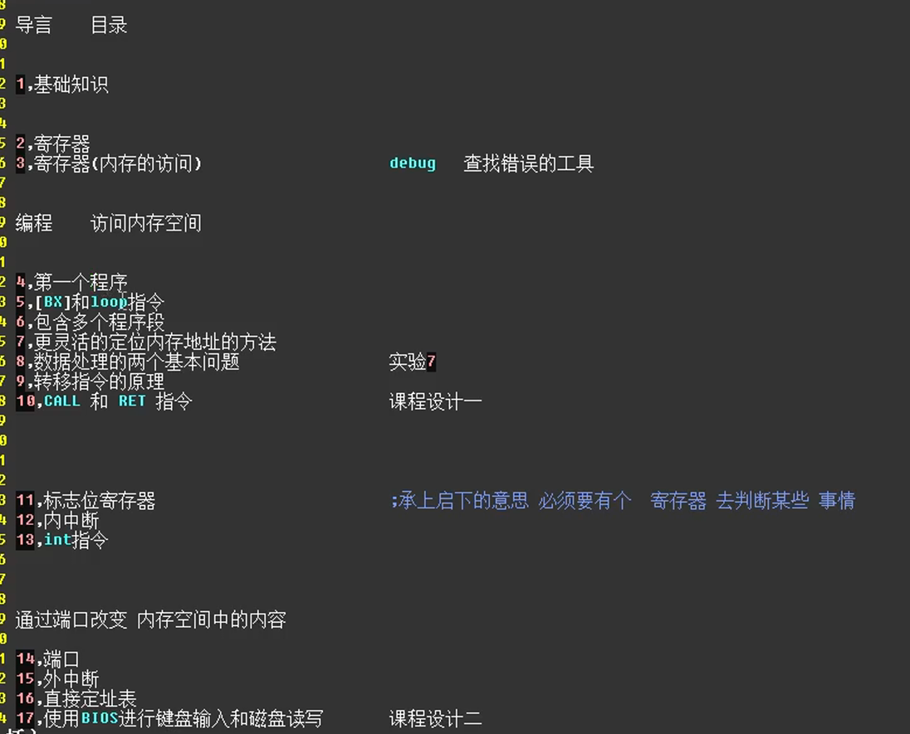

## 6 寄存器

### 6.1 通用寄存器

8086cpu所有寄存器都是16位的，可以存放两个字节。ax,bx,cx,dx这4个寄存器通常用来存放一般性数据，被称为通用寄存器。

通用寄存器，存放数据的，数据寄存器，箱子是有容量的。

>1byte = 8bit
>
>2byte = 16bit   


>16位的范围表示
>
>0000 0000 0000 0000 ~ 1111 1111 1111 1111(二进制表示)
>
>0000 ~ FFFF (十六进制表示)
>
>0~65535


8086的上代寄存器是8位的，为了保证兼容，使原来的基于上代cpu编写的程序可以稍加修改就可以运行在8086的cpu上。8086的ax，bx，cx,dx,这4个寄存器可以分开成两个独立的寄存器使用：

>ax = ah+al    ah:高位寄存器 al：低位寄存器 h:height 高的,l:lower低的
>
>bx = bh+bl
>
>cx = ch+cl
>
>dx = dh+dl


>8位寄存器表示的范围
>
>0000 0000 ~ 1111 1111
>
>00~FF
>
>0~256


>16进制左边是高位，右边是低位


>内存最小单元？字节8bit
>
>cpu从内存中读取一个8bit的字节数据， 8位数据->8位寄存器中
>
>数据线？16根，数据线的宽度决定了cpu一次性能够读取多长的数据
>
>8086 cpu一次性可以处理两种尺寸的数据
>
>字节型数据 byte=8bit 8位寄存器
>
>字型数据 2byte = 16bit 16位寄存器,一个字节是高位字节(ah,bh,ch,dh)，一个是低位字节(al,bl,cl,dl)

### 6.2 加深ax,bx,cx,dx寄存器的映象(一)

>用Debug的R命令查看和改变寄存器中的内容
>
>用Debug的D命令查看内存中的内容
>
>用Debug的E命令改写寄存器中的值
>
>用Debug的U命令将内存中的机器指令翻译成汇编指令
>
>用Debug的T命令执行一条机器指令
>
>用Debug的A命令以汇编指令的格式在内存中写入一条机器指令
>
>Debug命令比较多，共有20多个，但是这6个命令和学习汇编语言是密切相关的。在后面内容我们还会学习到p命令


>mov ax,5

>mov ax,0
>
>mov al,5

>mov ax,4e20
>
>mov bx,ax
>
>mov ch,bl
>
>mov cl,bh
>
>mov dl,ch
>
>mov ax,dx


>mov  ax,bl
>
>mov bh,ax
>
>mov a1,100
>
>mov ax,10000
>
>mov al,0005
>
>


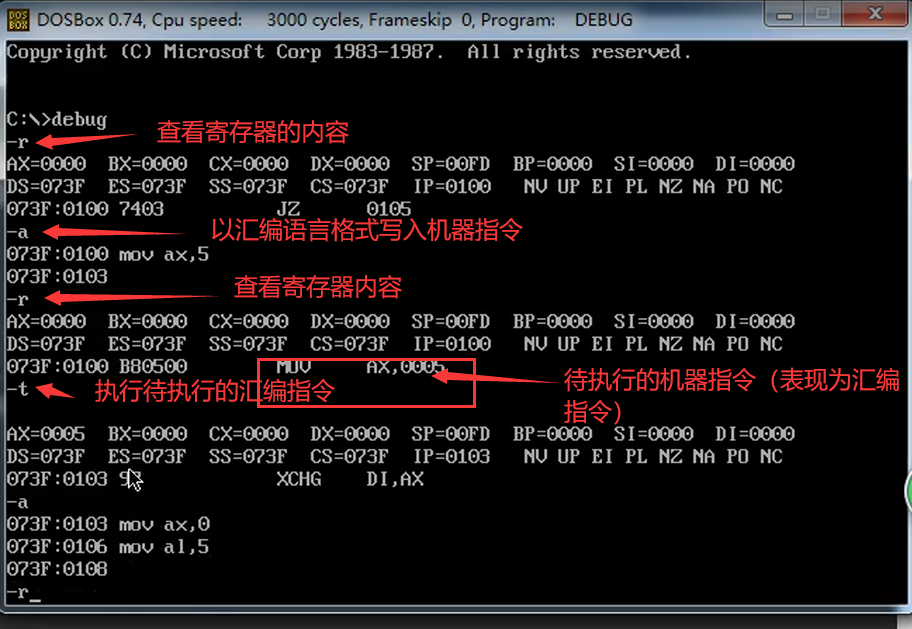

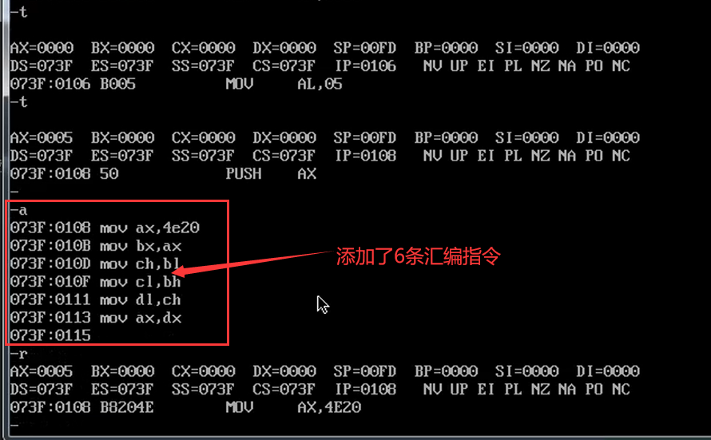

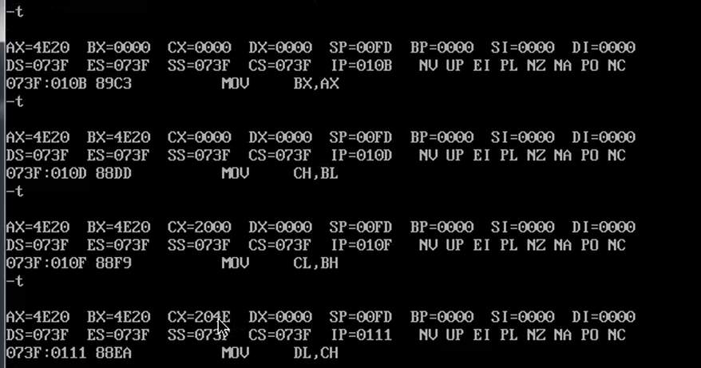


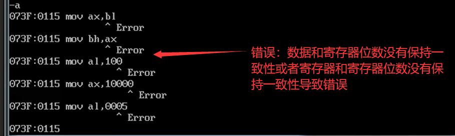


这里只是使用了移动指令，如果加法超过寄存器中的最大值会怎么样？

### 6.3 加深ax,bx,cx,dx寄存器的映象(二)

做实验，看一下加法超过寄存器的最大值会怎么样？

>mov ax,18 相当于 ax=18
>
>mov ah,78 相当于ah = 78
>
>add  ax,8  相当于 ax = ax+8


>mov bx,ax 相当于 bx = ax
>
>add ax,bx 相当于 ax = ax+bx


>mov ax,0   相当于 ax = 0
>
>mov ax,93h 相当于 ax = 93
>
>add al,85h  相当于 al =al+ 85


>mov ax,0  相当于 ax = 0
>
>mov al,93h  相当于 al = 95
>
>add ax,85h  相当于ax = ax+85


>mov ax,4e20h
>
>add  ax,1406h
>
>mov bx,2000h
>
>add ax,bx
>
>mov bx,ax
>
>add ax,bx                                          产生结果044c(正确结果1044c)


>add al,100h   无法执行，al只能存储两个字节
>
>add ax,10000h 无法执行，ax只能存储四个字节
>
>add al,ax  不同寄存器之前不可操作，8位和16位不可以操作

### 6.4 检测点2.1

写出每条指令执行后相关寄存器中的值

注：这里的数都是十六进制数

mov ax,f4a3     ax = f4a3

mov ah,31        ax = 31ah

mov al,23          ax = 3123

add  ax,ax         ax = ax+ax = 6246

mov bx,826c     bx = 826c

mov cx,ax          cx = ax = 6246

mov ax,bx         ax = bx = 826c

add ax,bx          ax = ax+bx = 826c+826c = 104c = 104d8  由于只能保存4位，截断 ax = 04d8

mov al,bh          bh = 82,al = 82,ax = 0482

mov ah,bl           bl = 6c,ax= 6c82

add  ah,ah         ah = 6c,ah = ah+ah = 6c+6c = d8 ,ax = d882

add al,6             al = 82,al = al+6 = 88,ax = d888

add al,al            al = 88,al = al+al = 88+88 = 110 截断，al = 10

ax = d810

mov ax,cx         ax = 6246

只能通过目前学过的汇编指令，最多使用4条指令，编程计算2的4次方 

mov ax,2

add ax,ax

add ax,ax

add ax,ax

### 6.5 表示内存地址信息的寄存器

像诸如ax,bx,cx,dx;ah,bh,ch,dh;al,bl,cl,dl这些都是数据寄存器，现在我们来学习一下地址寄存器。

先用r命令查看各个寄存器的值，使用d命令查看内存中的内容，

>段地址寄存器 ：偏移地址
>
>ds							sp
>
>es						     bp
>
>cs                              si
>
>ss                              di
>
>​                                  ip

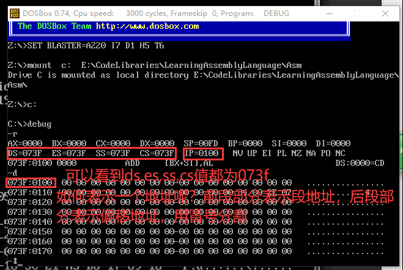


寄存器是16位的，可以表示的范围为0000~ffff

8086cpu给了它20根地址线，地址线的数量决定了cpu的寻址能力，但是寄存器是16位的，

>地址加法器：
>
>地址的计算方式 段地址*16+偏移地址 = 物理地址

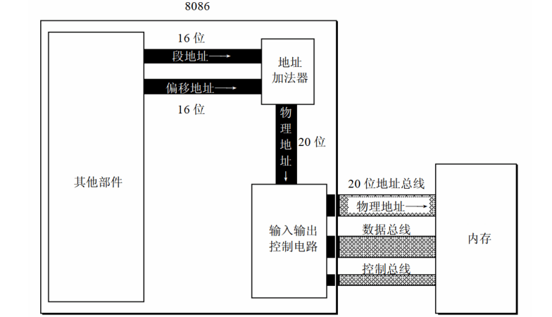

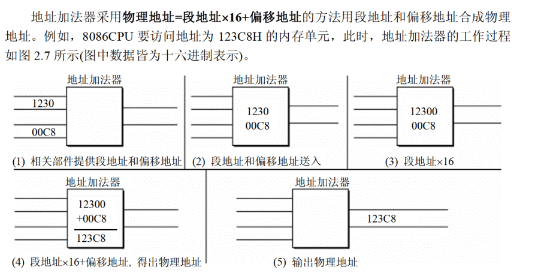

### 6.6 加深地址计算方式的映象

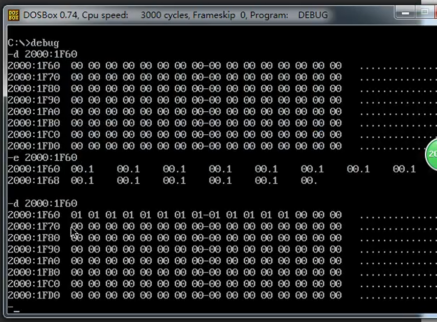


### 6.7 检测点2.2

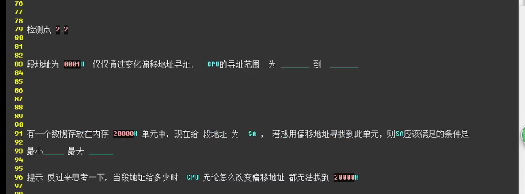

### 6.8 cpu是如何区分指令和数据

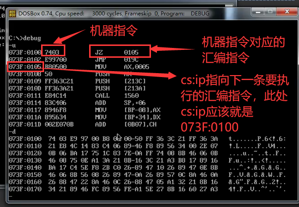

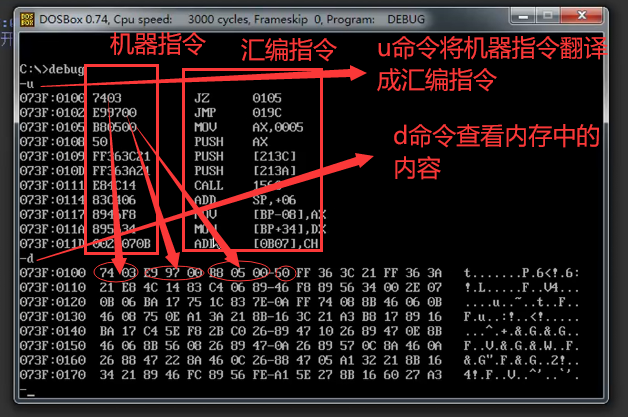

8086的cpu中，在任意时刻，cpu将cs:ip指向的内容，全部当成指令来运行。

内存中指令和数据是没有区别的，都是以二进制存在。cpu根据什么将内存中的信息当做指令?

### 6.9 加深cpu如何区分指令和数据的印象

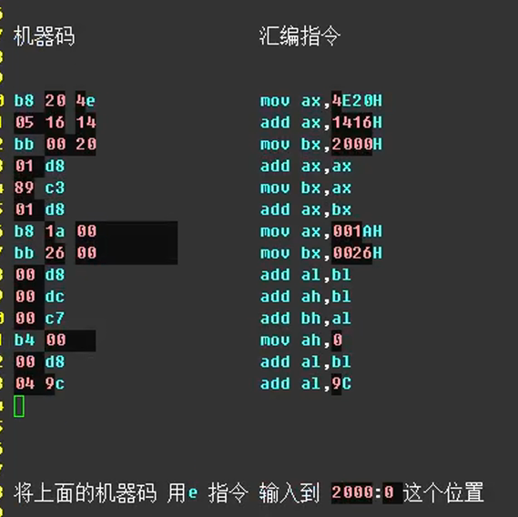

通过e命令命令修改2000:0位置的值

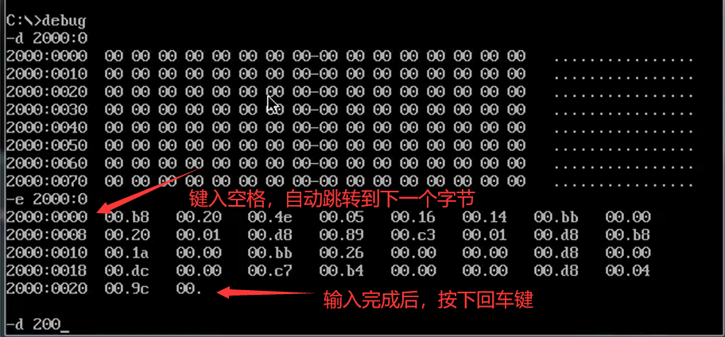

通过d命令查看内存中的值

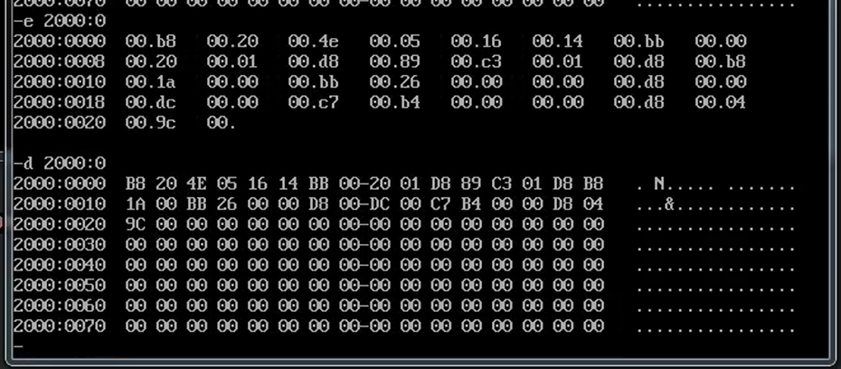

通过u命令，将机器指令翻译成汇编指令

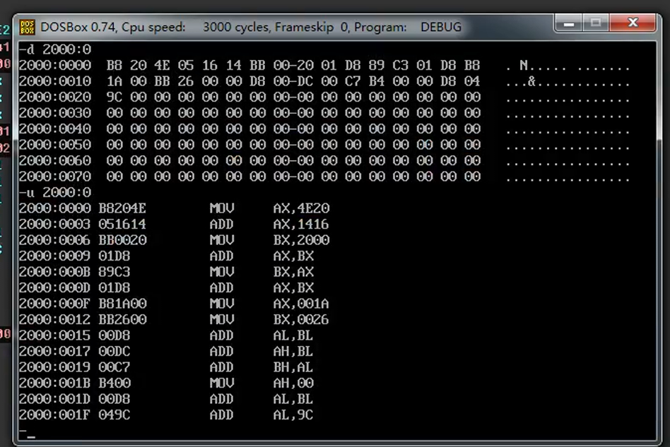

通过cs和ip到cs:ip  = 2000:0

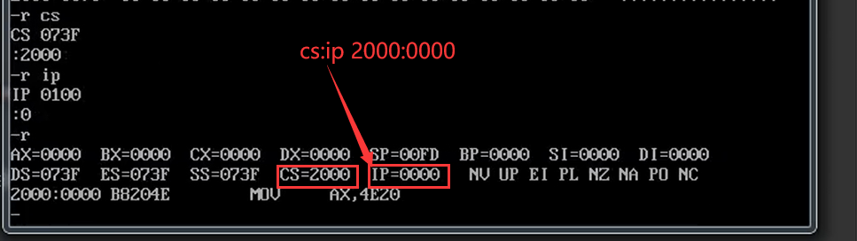

之后通过t命令-t命令来执行这些就可以了

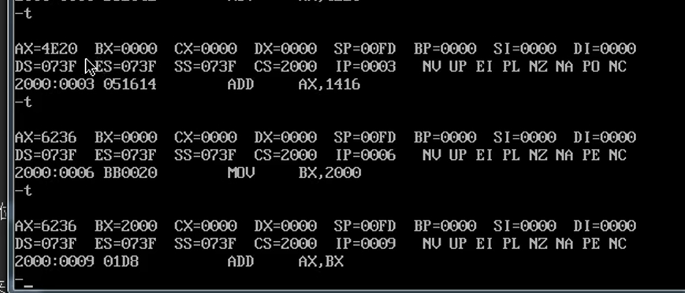


指令和数据在内存中是没有区别的？

cpu中的cs:ip指向的地址中的数据，被读取，然后当成指令来运行（执行t命令会触发）。

### 6.10 ip和寄存器指令的关系

指令是有长度的，一条指令有多个字节组成

指令的执行过程

>1 cpu从cs:ip所指向的内存单元中读取指令，存放到指令缓存器中
>
>2 ip = ip+所读指令长度，从而指向下一条指令
>
>3 执行指令缓存器中的内容，回到步骤1

有个疑问？

如何知道指令的长度？

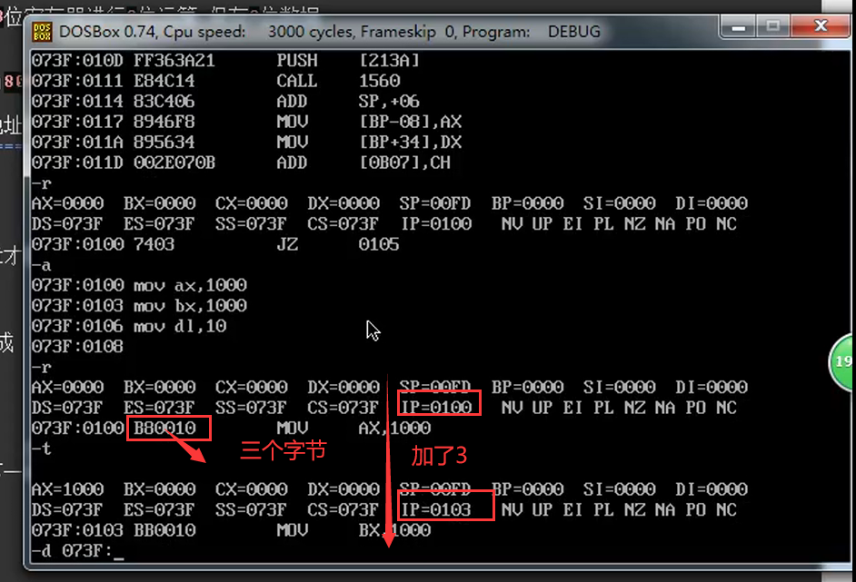

### 6.11 修改cs:ip寄存器的指令

汇编指令：jmp，是英语jump的简写形式，

转移指令，可以修改cs和ip两个寄存器的值，决定了cpu从哪里读取指令，如

>jmp 2000:0 

执行此条命令cs=2000,ip=0000

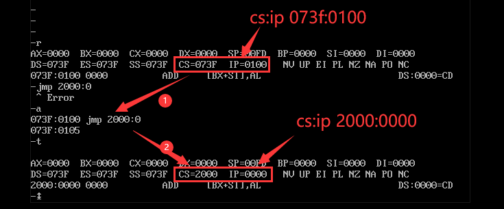

还有一种指令的执行方式

>jmp 寄存器
>
>jmp ax

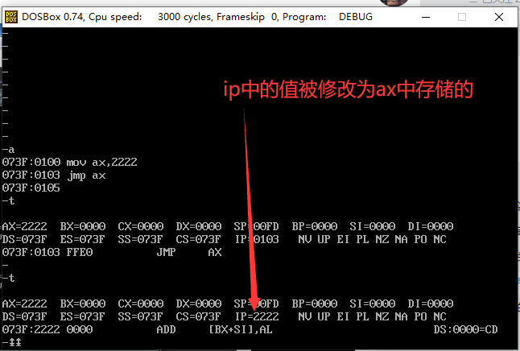

查看 x:y 所对应的汇编指令详细

>u 073f:0100


### 6.12 指令执行过程设计原因

略

### 6.13 检测点2.3


### 6.14 debug调试工具使用总结


### 6.15 实验任务(一)


### 6.16 实验任务(二)


>debug
>
>-a  2000:0000
>
>mov ax,1
>
>add ax,ax
>
>jmp 2000:0003

>-a 073f:1000
>
>jmp 2000:0000

>执行t命令，即可


### 6.17 承上启下

数据寄存器

地址寄存器 段地址寄存器+编译地址寄存器

通用寄存器：ax,bx,cx,dx 可分割为al,ah,bl,bh,cl,ch,dl,dh;ax是16位寄存器，可分割为al+ah为两个8位寄存器。

在操作寄存器时候，需要保持数据位数的一致性

移动指令mov

运算指令add,sub

跳转指令jmp,jmp可以改变cs:ip寄存器的值

段寄存器:偏移寄存器 如:cs:ip jmp 寄存器

## 7 字节数据和字型数据、栈

### 7.1 字节数据和字型数据

新的要求，通过观察和思考，去猜测设计者为什么要设计，积累了足够多的知识。

字节数据:1byte

字型数据:2byte,字型数据有两个连续的地址的内存单元组成，高地址 的内存单元存放字型数据的高位，低地址内存单元存放字型数据的低位


### 7.2 加深字节型数据，字型数据的印象(一)


### 7.3加深字节型数据，字型数据的印象(二)


利用debug的a指令写入命令，利用mov 指令向10000H、10001H,10002H,10003H写入数据，之后，键入debug的t命令执行，观察ax,bx，cx寄存器的值


利用debug的a指令写入命令，利用mov 指令向10000H、10001H,10002H,10003H写入数据，之后，键入debug的t命令执行，观察ax,bx，cx寄存器的值

### 7.4 加深字节型数据、字型数据的印象（三）

```asm
mov al,ds:[0] ;将一个byte存入al中
mov ax,ds:[0] ;将两个byte存入ax中
```

### 7.5 小结

字节型数据：在内存中存储时候，使用一个内存单元存放

字型数据：在内存中存储时候，需要两个连续内存单元存放，高位字节对应高地址，低位字节对应低地址

ds:段地址寄存器，数据段地址寄存器

cs:指令相关

>mov al,ds:[0]
>
>mov ax,ds[0]

不要去记，直接在debug中去尝试


cs:ip 确定指令位置

dx:[bx] 确定数据位置

### 7.6 检测点3.1(一)


> 注意：
>
> * 数据从哪里来
>
> * 处理的是字型数据还是字节型数据
> * 根据ds:[偏移值]获取到相应位置的数据

### 7.7 检测点3.1(二)

略

### 7.8 监测点3.1(三)


#### 1、写出cpu执行指令的序列

>mov ax,6622h
>
>jmp 0ff0:0100h	;0ff0*10+0100 =  10000h
>
>mov ax,2000h
>
>mov ds,ax
>
>mov ax,[0008]
>
>mov ax,[0002]

#### 2、写出cpu执行每条指令后，cs,ip和相关寄存器的值


#### 3、再次体会数据和程序(指令)之间有区别吗？如何确定内存中哪些是数据,哪些是指令(程序)?


### 7.9 检测点3.1(四)

在debug中执行相关程序，验证 <<7.8 监测点3.1(三)>>中的推测内容

### 7.10 栈的概念的前言

栈：是一段连续的内存单元，也就是一段连续的内存地址,特殊的访问形式：先进后出

### 7.11 栈的概念 --- 实际例子的角度


>1、栈顶标记	标记了箱子中最上面的这本书，在箱子中的位置
>
>2、栈	箱子
>
>3、入栈	将书放到箱子中，最上面
>
>4、出栈	取出箱子最上面的这本书
>
>5、结论	由于不断的入栈和出栈，我们需要不断修改栈顶标记，确定栈顶位置

### 7.12 栈的概念---内存的角度

入栈 push

```assembly
push ax ;正确 push可以操作16位寄存器
push al	;错误 push不可以操作8位寄存器

;push 是将16位寄存器或者内存中的16位的数据放入栈顶，然后修改栈顶标记(标记上移)
```


出栈 pop

```assembly
pop ax  ;正确 push可以操作16位寄存器
pop al	;错误 push不可以操作8位寄存器

;pop 是将16位寄存器或者内存中的16位的数据从栈顶取出，然后修改栈顶标记(标记下移)
```


数据从哪里来？ 

寄存器中，内存中

数据的长度？

字节型数据，字型数据


总结：

栈顶标记是内存地址，用段地址和偏移地址来表示。在8086cpu中，在任意时刻，将段地址寄存器和偏移地址sp组合的内存地址当成栈顶标记


>push ax
>
>修改sp寄存器中的数值 sp = sp -2
>
>将ax中的字型数据 -> ss:sp所组合的内存地址的字型数据


>pop ax
>
>将ss:sp所组成的内存地址中的字型数据 -> ax
>
>修改sp寄存器中的数值sp=sp+2

### 7.13 栈的一个问题

在debug中执行相关代码观察情况

```assembly
mov ax,0123
push ax
pop bx
```

### 7.14 栈的设置

栈 箱子


箱子画在哪里是我决定的

箱子的容量大小也是我决定的


我们就可以决定栈顶标记在哪里，决定栈在哪里，决定栈的容量大小

>比如：我们可以将2000:0~2000:f设置成栈的空间，栈的空间大小为16byte
>
>栈顶为2000:10h


栈如何设置?

自己的一个约定，防止一些稀奇古怪的问题

### 7.15 栈的越界问题

>push越界问题：
>
>就像水缸的水装满了，在倒水进去就会溢出
>
>pop 越界问题
>
>就像水缸水已经没了，但是你还要取水
>
>这样可能会修改其他正常的命令或者数据，导致程序运行不正常


>ss:sp 栈顶标志
>
>根据最大可能用到的空间，来设置栈的大小

### 7.16 栈的极限大小

一个栈的最大空间可以设置为多少？

>64kb

sp寄存器的变化范围？

>64k

设置一个存放32768字型数据的箱子？

>ss = 2000h
>
>sp = 0

如果pushle32768个字型数据之后，还push字型数据的话，会产生结果？

>就会覆盖栈中的值

### 7.17 栈的作用(一)

临时性保存数据

### 7.18 栈的作用(二)

用栈进行临时保存数据


用栈进行数据交换


笔记的记录方式：也是一种栈的

平常打字，也是一种栈，打字是入栈，从尾部删除是出栈

### 7.19 检测点3.2(一)


关于上述这个问题的话：可以创建一个栈，栈的位置可以设置为10000H~1000FH,即是cs=1000 ip = 16 = 10H，

### 7.20 检测点(二)


### 7.21 实验任务(一)


书中关于push指令执行的详细过程：


>sp = sp -2
>
>(ss:ip) = ax 

书中关于pop指令的执行详细过程：


>ax = (ss:ip)
>
>sp=sp+2

### 7.22 实验任务(二)

此问题不要深究，看不懂可以先不看


### 7.23 承上启下(一)

#### 内存可以存取什么

我们可以在一段内存中存放数据（存放自己定义的数据）

我们可以在一段内存中存放我们的指令(代码段)

我们可以将一段内存定义为栈空间，因为我们处理数据需要临时性存放 

#### 我们如何让cpu按照我们的安排去访问这些内存段呢？

对数据段来说，段地址（ds寄存器） [0],[1].....  使用mov add sub指令访问这些内存单元，那么cpu就会将我们定义数据段中的内容，当做数据访问

对于代码段来说，我们可以修改cs:ip这两个寄存器，去指向我们的代码段，这样cpu就执行我们定义代码段的指令

对于栈段来说，我们可以通过修改ss:sp这两个寄存器，去决定栈顶标记在哪，这样cpu在执行站的操作时候，如push,pop就会将我们定义的栈段，当做栈空间使用

>cpu指令:cs:ip指向数据
>
>ss:sp确定栈顶位置
>
>ds:[0]确定数据

### 7.24 承上启下(二)


### 7.25 承上启下(三)


### 7.26 承上启下(四)

伪指令：告诉编译器这里该如何翻译，那里该如何翻译

一个程序：数据段，栈段，代码段的标识

这里只是介绍基本知识，如有疑惑，请忽略

这里只要知道伪指令的作用即可

### 7.27 课堂笔记和一些想说的话

学到这里的话，可以感觉到学习汇编的话，所谓的天赋或者所谓的智商，都不需要，需要的是耐心和一些细心的思考。

初学者，应该在回头看看,从设计者的角度去思考，去观察，不要禁锢自己的想法，跳出思维的条条框框

遇到疑惑了，debug中去尝试一下，只要符合规则就行了

### 7.28 补充

略

## 8 编译和链接

### 8.1 为啥要编译和链接


### 8.2 exe可执行文件


可以修改start标记，再次编译产生新的map文件，观察map文件内容

>exe可执行文件，不止包括了我们整个程序，还包括了描述信息
>
>系统是根据这些描述信息，进行相关设置
>
>具体的原理大家不必深究

### 8.3 源程序

asm文件夹下的eg1.asm,介绍了第一个汇编语言解释相关内容


>以下指令功能
>
>```
>mov ax,4c00h
>int 21h
>```
>
>系统在加载程序时候，给程序分配内存，设置寄存器，执行上述指令后，内存和寄存器都会还给系统，如果不还给系统，永远的占用内存，内存是有限的，这样最终的话，系统是没有内存可以使用的

### 8.4 关于程序的跟踪


>程序的跟踪 debug + 程序名
>
>cx = 程序的长度
>
>p执行int指令
>
>q退出
>
>psp区域：从ds:[0]开始的256个字节，作用是系统和程序之间通信的

### 8.5 实验3


### 8.6 后面几章的学习目标

>psp区
>
>栈段
>
>数据段
>
>代码段
>
>基本的代码框架

### 8.7 本章节只需要掌握的内容

### 8.8 系统分配的内存

>系统分配的内存的过程是安全的
>
>要运行程序，系统就要给他分配内存，之后要安排自己的代码段，数据段，栈段等

## 9 Loop指令

### 9.1 内存访问方式[bx]代替[0]

之前使用的方式

> 数据从哪里来：ds:[0],ds:[1]....
>
> 数据的长度:字节型数据，字型数据
>
> ```
> mov ax,ds:[0]
> mov al,ds:[0]
> ```

现在的使用方式

>数据从哪里来: ds:[bx]
>
>访问字型数据
>
>mov  bx,0
>
>mov ax,ds:[bx]
>
>add bx,2
>
>mov ax,ds:[bx]

>访问字节型数据
>
>mov bx,0
>
>mov al,ds:[bx]
>
>add bx,1
>
>mov al,ds:[bx]

### 9.2 [bx]的问题

inc指令：increase(增加)

inc bx (bx=bx+1)


inc bx 和 add bx,1比较

inc bx指令占用一个字节

add bx,1 占用3个字节

为了节约内存


程序和内存中的情况如图所示 写出程序执行后，21000h~21007h内存单元的内容


通过一直增加bx的值，访问ds:[bx]指向的值，类似c语言中数组的访问方式

### 9.3 loop指令(一)

假设我们要向2000h:1000h这里开始写0123456789ABCDEF这些字节型数据，通过编程该怎么做？

```assembly
mov ax,2000h
mov ds,ax
mov bx,1000h

mov dl,0

mov ds:[bx],dl;(dl)=0 (bx)=1000
inc dl;(dl)=1
inc bx;(bx)=1001

mov ds:[bx],dl;(dl)=1
inc dl;(dl)=2
inc bx;(bx)=1002

mov ds:[bx],dl
inc dl
inc bx

....
....
....

```

我们需要不断执行3条指令，需要执行16次，换句话来说就是让cpu不断执行这3条指令，可以使用jmp跳转指令去修改cpu中ip寄存器的值就可以了，不过引入了一个问题，啥时候结束这个循环

```assembly
			mov ax,2000h
			mov ds,ax
			mov bx,1000h
			mov dl,0
setNumber:	mov ds:[bx],dl
			inc dl
			inc bx
			jmp setNumber;setNumber是标号，这里表示mov ds:[bx],dl的内存地址
```

### 9.4 loop指令（二）

loop：循环指令，跳转(jmp)指令,按照次数来跳转，循环次数（跳转次数），保存在cx寄存器中。

loop指令2个步骤：

1,cx = cx - 1

2,判断cx中的值，不为零则跳转（jmp)到标号（内存地址）位置后，继续执行，不等于零则执行下面命令

```assembly
			mov ax,2000h
			mov ds,ax
			mov bx,1000h
			mov dl,0
			mov cx,16
setNumber:	mov ds:[bx],dl
			inc dl
			inc bx
			loop setNumber
```

如何快速执行loop指令


或者通过g指令（可理解为goto)直接跳转到对应的指令


这样就不需要使用t指令一直观察循环中的指令

## 17 内中段

### 17.1中断向量表

中断：发生了需要cpu立刻去处理的信息，需要一个程序去处理

>1 除法错误 divide overFlow 
>
>2 单步执行
>
>3 执行into指令
>
>4 执行int指令

中断向量表：根据中断码，去中断向量表中找到对应的中断处理程序的入口位置

| 中断码 | 中断程序对应的入口地址        |
| ------ | ----------------------------- |
| 0      | 0号中断对应处理程序的入口地址 |
| 1      | 1号中断对应处理程序的入口地址 |
| 2      | 2号中断对应处理程序的入口地址 |
| ...... | ......                        |

中断向量表存放的位置：0000:0000 -  0000:03FF的1024个单元存放着中断向量表，一个表项占4个字节，低位存放偏移地址，高位存放段地址


### 17.2 检测点12.1

### 17.3 中断过程

### 17.4 实验12

### 17.5 中断特殊情况TF IF标志位


## 附注

### 键盘扫描码集

参考博客地址：[键盘扫描码集（共三版）_m0_51209350的博客-CSDN博客_键盘扫描码](https://blog.csdn.net/m0_51209350/article/details/109237270)


### ”welcome to masm!"转化

>字符串：welcome to masm!
>
>十进制：119,101,108,99,111,109,101,32,116,111,32,109,97,115,109,33
>
>16进制：77,65,6c,63,6f,6d,65,20,74,6f,20,6d,61,73,6d,21